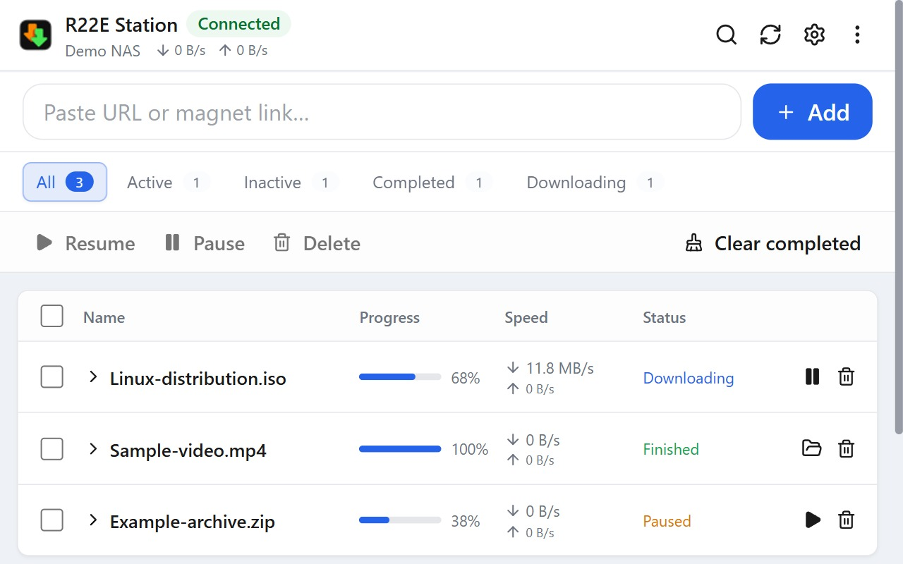
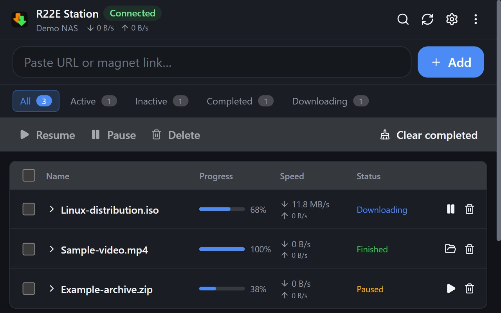
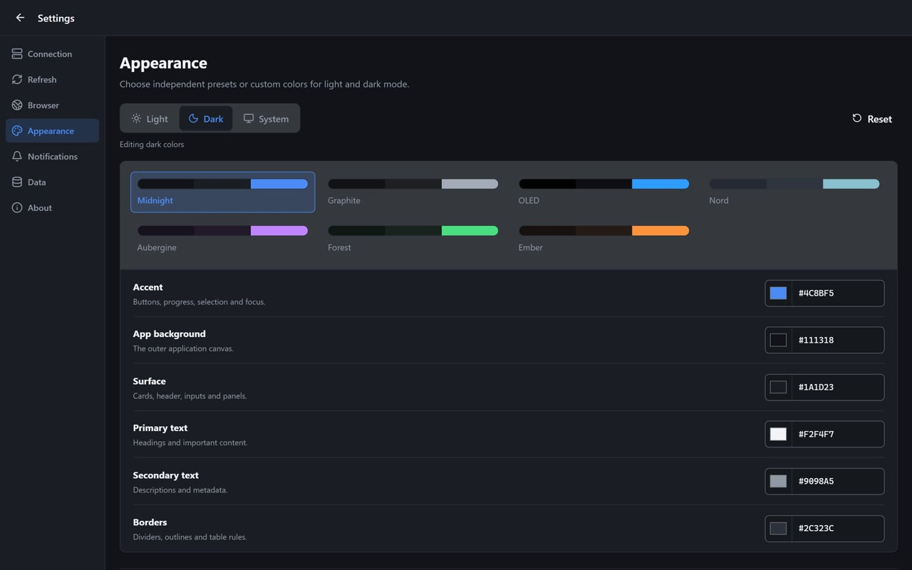

# R22E Station

**Synology Download Station by R22E** — manage downloads on your own NAS without leaving the browser.

[Product page](https://r22e.com/plugins/synology-download-station) · [GitHub releases](https://github.com/r22ehq/Synology-Download-Station-by-R22E/releases) · [Privacy policy](PRIVACY.md) · [Report a bug](https://github.com/r22ehq/Synology-Download-Station-by-R22E/issues/new)

> **Chrome Web Store:** the listing is not published yet. The [product page](https://r22e.com/plugins/synology-download-station) will link to the official listing as soon as it is live. Until then, release packages will be available on GitHub after the first tagged release.

## What it does

- Add HTTP(S), FTP, magnet links, and torrent files to Synology Download Station.
- Pause, resume, remove, search, and inspect tasks; open a completed task's destination in File Station.
- Send a selected link from the right-click menu, or collect candidate links from the current page on demand.
- Keep a side panel open while browsing, with responsive controls down to narrow widths.
- Choose light, dark, or system appearance and optional completion notifications.
- Connect directly to a local NAS or custom address. Experimental QuickConnect-ID discovery supports direct routes only, not relay.

The extension requires your own compatible Synology NAS, Download Station, and a user account. It has no R22E cloud account, analytics, or telemetry service.

## Interface

These are captures of the actual extension using a local mock NAS and synthetic filenames. No private NAS address, account, or tracker data appears in the images.

| Light | Dark |
| --- | --- |
|  |  |

The [compact side-panel view](docs/media/tasks-compact-880x1520.jpg) keeps progress, status, and per-task actions visible.

## Browser support

| Browser | Status | Package |
| --- | --- | --- |
| Google Chrome | Tested with Chromium | [Chrome builds](https://github.com/r22ehq/Synology-Download-Station-by-R22E/releases) |
| Microsoft Edge | Chromium build; manual browser QA recommended | [Edge builds](https://github.com/r22ehq/Synology-Download-Station-by-R22E/releases) |
| Mozilla Firefox | Build available; manual execution pending | [Firefox builds](https://github.com/r22ehq/Synology-Download-Station-by-R22E/releases) |
| Opera | Chromium build; manual browser QA recommended | [Opera builds](https://github.com/r22ehq/Synology-Download-Station-by-R22E/releases) |
| Arc | Chromium compatibility expected; manual QA pending | [Chrome builds](https://github.com/r22ehq/Synology-Download-Station-by-R22E/releases) |
| Safari | Planned | — |

The links above point to the releases page; no public package is available until the first release is tagged. For source builds and unpacked installation, see [Contributing](CONTRIBUTING.md).

## Getting connected

Open **Settings → Connection → Add NAS**. The local connection is recommended: enter your NAS address and an account with Download Station access. HTTPS is strongly recommended, particularly outside a trusted local network. HTTP does not protect your password or task data in transit. Two-factor authentication is supported when your NAS requests a code.

QuickConnect-ID is an **unofficial experimental** option. It may break when Synology changes its service, and it cannot use QuickConnect relay. A directly reachable local address, DDNS name, or your own remote URL is more reliable.

## Privacy and security

The extension requests NAS host access when you configure a connection and requests source-site access when a selected action needs it; it does not request blanket access to every website by default. Optional saved passwords are kept in extension-local browser storage **without extension-level encryption**. Review the [privacy policy](PRIVACY.md) and [security guidance](SECURITY.md) before using this on an untrusted device.

This independent project is not affiliated with or endorsed by Synology Inc. Synology and Download Station are trademarks of their respective owners.

## Contributing

Build instructions, development setup, test commands, and real-NAS test safety rules live in [CONTRIBUTING.md](CONTRIBUTING.md). Maintainers can follow the [release process](RELEASING.md). Issues and pull requests are welcome.

Licensed under [MIT](LICENSE).
